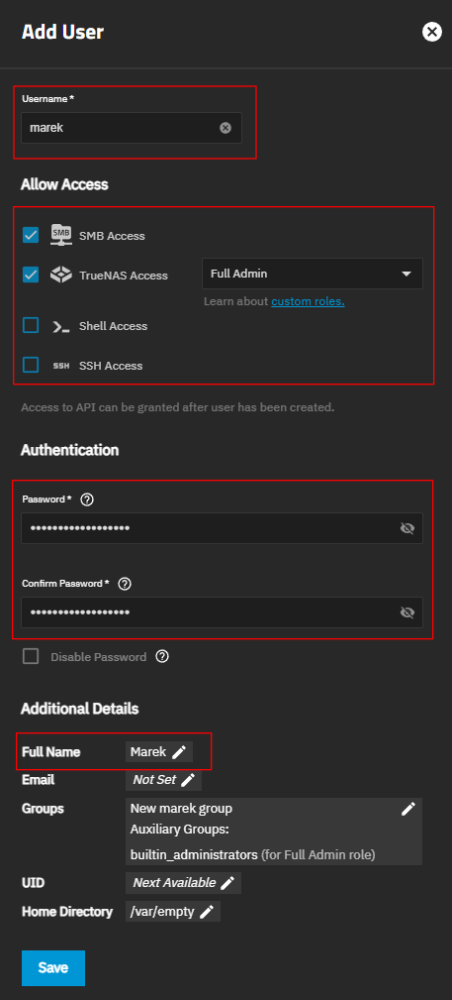

# Initial TrueNAS Setup

## 1. Setting localization

- Open page: `System` / `General Settings`.

- Find `Localization` widget and press `Settings` button.

- Set `Language` to: `English (en)`.
         
    **_Most instructions or troubleshooting methods on the Internet are in English._**

     **_I also use the English names for pages, options, labels, etc., throughout the whole manual._**

- Other settings set based on your localization/preferences.

## 2. Create your own admin user

- Open page: `Credentials` / `Users`

- Press the `Add` button

- Set your username, access rights, a strong password, and your full name. Leave the rest of the settings at their defaults.

    _(Set the permissions as in the picture below, you can always change them later if necessary.)_

    

- _optional (but recommended):_ 
  
  log in as the new admin user and remove the `truenas_admin` user (as an additional security measure)