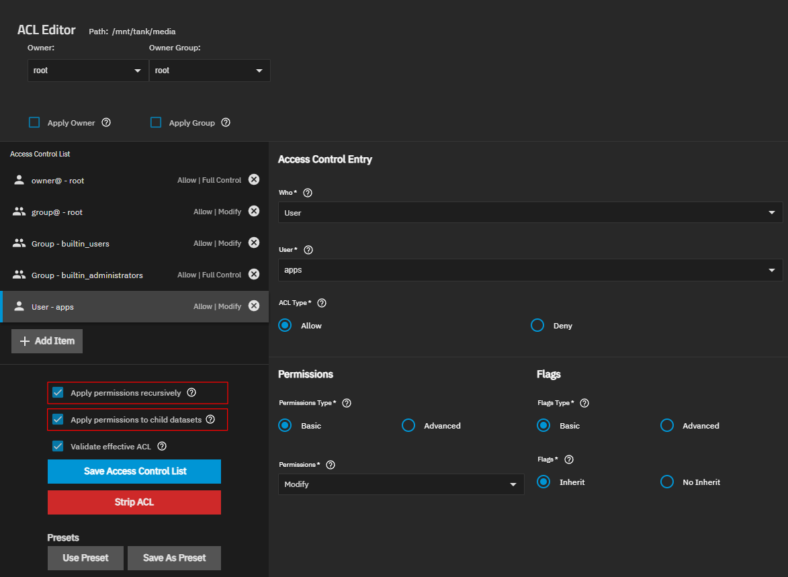

[← Back to the main guide's steps](../README.md)

# ARR Stack: General

**Table of Contents**   
[1. Storage structure](#1-storage-structure)  

## 1. Storage structure


/mnt/tank/configs/dozzle

Here is my datasets structure

```js
tank [POOL]
|
├── configs [DATASET] - Dataset Preset: `Apps`
|   ├─ bazarr [DATASET] - Dataset Preset: `Apps`
|   ├─ dozzle [DATASET] - Dataset Preset: `Apps`
|   ├─ jellyfin [DATASET] - Dataset Preset: `Apps`
|   ├─ jellyseerr [DATASET] - Dataset Preset: `Apps`
|   ├─ prowlarr [DATASET] - Dataset Preset: `Apps`
|   ├─ qbittorrent [DATASET] - Dataset Preset: `Apps`
|   ├─ radarr [DATASET] - Dataset Preset: `Apps`
|   ├─ recyclarr [DATASET] - Dataset Preset: `Apps`
|   ├─ sonarr [DATASET] - Dataset Preset: `Apps`
|   └─ tdarr [DATASET] - Dataset Preset: `Apps`
|
├── media [DATASET] - Dataset Preset: `Apps`
|   ├─ books [FOLDER]
|   ├─ movies [FOLDER]
|   ├─ music [FOLDER]
|   └─ tv [FOLDER]
|
└── downloads [DATASET] - Dataset Preset: `Apps` 
    |
    ├── torrents [DATASET] - Dataset Preset: `Apps`
    |   ├─ books [FOLDER]
    |   ├─ movies [FOLDER]
    |   ├─ music [FOLDER]
    |   └─ tv [FOLDER]
    |
    └── usenet [DATASET] - Dataset Preset: `Apps`
        |
        ├─ incomplete [FOLDER]
        |  ├─ books [FOLDER]
        |  ├─ movies [FOLDER]
        |  ├─ music [FOLDER]
        |  └─ tv [FOLDER]
        |
        └─ complete [FOLDER]
           ├─ books [FOLDER]
           ├─ movies [FOLDER]
           ├─ music [FOLDER]
           └─ tv [FOLDER]
```

- Create datasets:
  ```
  /mnt/tank/media
  /mnt/tank/downloads
  /mnt/tank/downloads/torrents
  /mnt/tank/downloads/usenet
  ```

- Create folders according to the structure shown above.

- Now you need to add the appropriate permissions for the folders inside the newly created datasets. \
  The easiest way to do this is to edit the permissions for each of the newly created datasets and follow these steps:
  - select the `Apply permissions recursively` checkbox \
    If a dialog box appears with the warning "Setting permissions recursively affects this directory and any others below it. This can make data inaccessible." confirm the change in the dialog box.

  - select the `Apply permissions to child datasets` checkbox \
    this checkbox will appear after selecting the first one

  - press the `Save Access Control List` button

    


<!-- Check ACL (Permissions / Edit) of each of newly created dataset, it should look like that:  
 -->


<!-- Create folders inside the datasets by running those command, one by one:
```bash
mkdir -p /mnt/tank/media/{books,movies,music,tv}
```
```bash
mkdir -p /mnt/downloads/torrents/{books,movies,music,tv}
```
```bash
mkdir -p /mnt/downloads/usenet/{books,movies,music,tv}
``` -->

<!-- Check if `Apps` user/group has proper permissions to datasets and folders. \
This should be set automatically since we selected the `Apps` preset when creating the dataset, but we should verify this before proceeding to install and configure all the required applications. \
Permissions for User/Group should look like that: `775/664`. \
To set permissions, run:
```
sudo chown -R $USER:$GROUP /mnt/tank/media
sudo chmod -R a=,a+rX,u+w,g+w /mnt/tank/media
```
TrueNAS `Apps` `User (PUID)`/`Group (PGUID)` is `568`/`568`, so to set the folder ownership, run: \
`sudo chown -R 568:568 /mnt/tank/media`. -->


## 2. qBitTorrent


<p align="right"><sub>____________</sub></p>
<p align="right">
  <a href="../truenas-setup/next-setp">Next step →</a>
</p>
