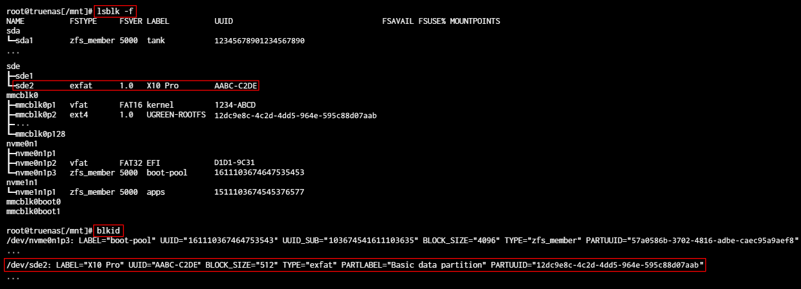
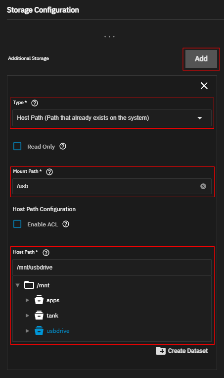
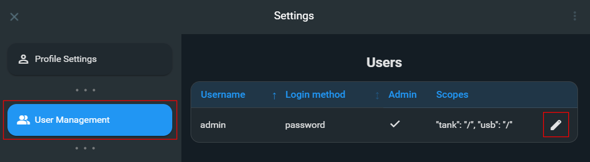
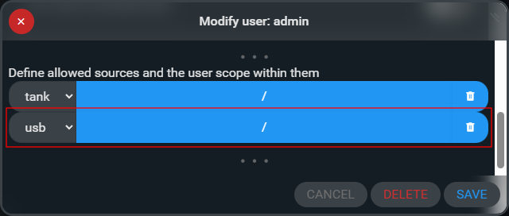
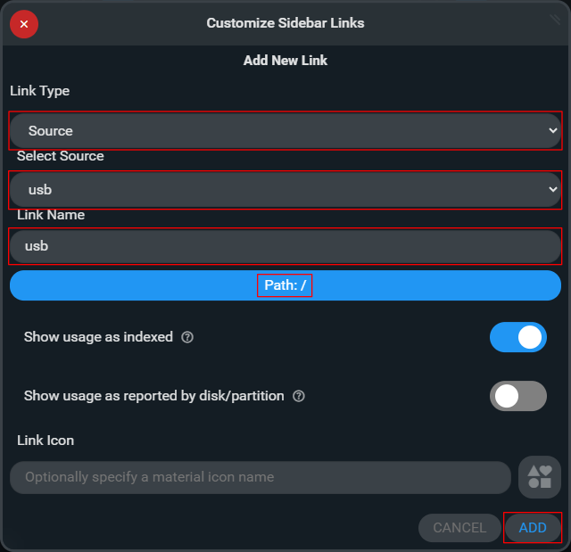

[← Back to the main guide's steps](../README.md)

# Copy data from USB using FileBrowser Quantum

**Table of Contents**   
[Step 1: Find the right device](#step-1-find-the-right-device)  
[Step 2: Create a directory that will serve as the mount point](#step-2-create-a-directory-that-will-serve-as-the-mount-point)  
[Step 3: Mount USB drive to the `/mnt/usbdrive` directory](#step-3-mount-usb-drive-to-the-mntusbdrive-directory)  
[Step 4: Configuration of FileBrowser Quantum](#step-4-configuration-of-filebrowser-quantum)  
[Step 5: Unmount USB drive](#step-5-unmount-usb-drive)  
&nbsp; &nbsp; [Reverting changes in the FileBrowser Quantum app](#reverting-changes-in-the-filebrowser-quantum-app)  
&nbsp; &nbsp; [Unmounting the USB drive and deleting the `/mnt/usbdrive` directory](#unmounting-the-usb-drive-and-deleting-the-mntusbdrive-directory)  


## Step 1: Find the right device
Find the device by running those 2 commands:
```bash
lsblk -f
```
```bash
blkid
```


In my case it is:
```bash
/dev/sde2
```
so in all the next steps I will use this name


## Step 2: Create a directory that will serve as the mount point 

Create directory:

```bash
sudo mkdir -p /mnt/usbdrive
```

## Step 3: Mount USB drive to the `/mnt/usbdrive` directory

Use on of this commands:
- Default:
  ```bash
  sudo mount /dev/sde2 /mnt/usbdrive
  ```

- If it's NTFS:
  ```bash
  sudo mount /dev/sde2 /mnt/usbdrive
  ```

- If it's exFAT:
  ```bash
  sudo mount -t exfat /dev/sde2 /mnt/usbdrive
  ```

<br />

To verify the mount we can open the `/mnt/usbdrive` directory and check files inside it.
```bash
cd /mnt/usbdrive
```
```bash
ls
```

## Step 4: Configuration of FileBrowser Quantum

If you haven't installed `FileBrowser Quantum` yet, here's [a link to instructions on how to do it](./Useful_Apps.md#4-filebrowser-quantum---installation-and-configuration).

Open TrueNAS `Apps` page, select the FileBrowser Quantum app on the list and press the `Edit` button.

Inside the `Storage Configuration` section, add `Additional Storage`:
- In the `Type` field, select the `Host Path (Path that already exists on the system)` option.
- In the `Mount Path` field, enter `/usb`.
- In the `Host Path` field, enter `/mnt/usbdrive`.



Save changes and redeploy the FileBrowser Quantum app.

Open FileBrowser Quantum WebUI, go to `Settings` page and select the `User Management` tab.

Find your user and press the `Edit` button.



To the `Define allowed sources and the user scope within them` section, add:  
- source: `usb`  
- scope: `/`  



Save changes, close FileBrowser Quantum WebUI and redeploy the app.

Open FileBrowser Quantum WebUI.

Click on the `Customize Sidebar Links` button inside the `Navigation`/`Links` sidebar widget.

Press the `+ ADD NEW LINK` button and select:
- Link Type: `Source`
- Selected Source: `usb`
- Link name: `usb`
- Path: `/`
- Select the `Show usage as indexed` checkbox
- Press the `ADD` button



> [!NOTE]
> Now you can use FileBrowser Quantum WebUI to copy files between USB and NAS drive.


## Step 5: Unmount USB drive

### Reverting changes in the FileBrowser Quantum app

Open FileBrowser Quantum WebUI

Remove Link to USB drive from the `Navigation`/`Links` sidebar widget.

Open `Settings` page, select the `User Management` tab and remove `usb` source from the `Define allowed sources and the user scope within them` section.

Close FileBrowser Quantum WebUI

Open TrueNAS `Apps` page and edit `FileBrowser Quantum` settings

Inside the `Storage Configuration`/`Additional Storage` section, remove the `/usb` entry.

Save changes and stop the FileBrowser Quantum app container.  
You can also stop it by running:
```
docker stop filebrowser-quantum
```

### Unmounting the USB drive and deleting the `/mnt/usbdrive` directory

To unmount drive, tun:

```bash
sudo umount /mnt/usbdrive
```
<br />

If you're seeing a specific error such as `umount: /mnt/usbdrive: target is busy`, you can run this commands to help determine what's preventing the unmount:  
```bash
lsof +D /mnt/usbdrive
```
```bash
fuser -vm /mnt/usbdrive
```
```bash
mount | grep usb
```
<br />

If the normal unmount still fails (only if necessary):
```bash
sudo umount -l /mnt/usbdrive
```
A lazy unmount detaches the filesystem immediately and cleans it up once it's no longer in use. This is generally safer than forcing an unmount.

<br />

Verify that `/mnt/usbdrive` is unmounted and is empty
  - ```bash
    cd /mnt/usbdrive
    ```
    ```bash
    ls
    ```
    If noting is listed, the drive is no longer mounted.

    You can also run:
  - ```bash
    findmnt /mnt/usbdrive
    ```
    If nothing is returned, the drive is no longer mounted.

<br />

Detach USB drive from the NAS

Remove directory `/mnt/usbdrive`:
```bash
sudo rm -r /mnt/usbdrive
```