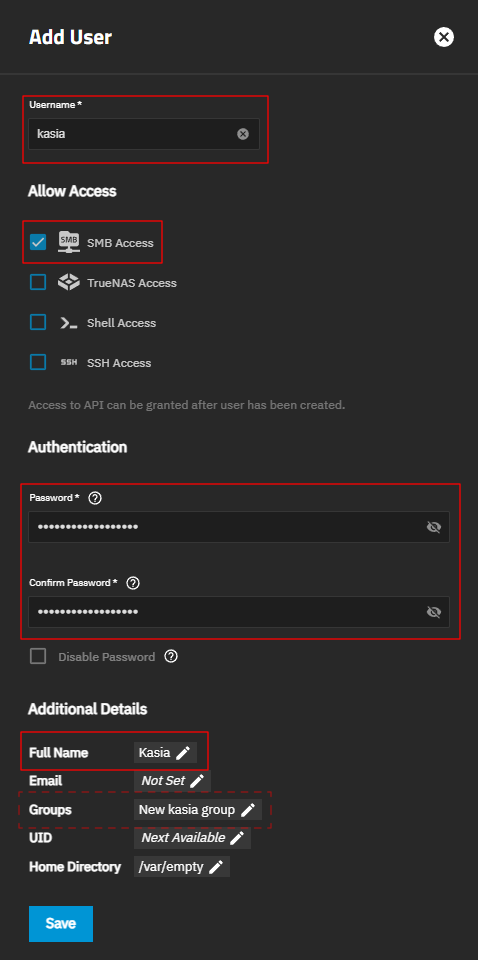

[← Back to the main guide's steps](../README.md)

# SMB Configuration

The file describes an example of:
- adding a user to whom we want to grant access to files on our NAS
- adding a dataset for backing up data for that user
- sharing this dataset via SMB (Server Message Block)
- mapping a network drive in the Windows operating system

## 1. Adding new user

- Open page: `Credentials` / `Users`

- Press the `Add` button
  - Set your `Username`.
  - Allow only for `SMB Access`.
  - Set user `Password`.
  - Set user `Full Name`.
  - ***For more information about user `Groups`, see the note below the image.***
  - Leave the rest of the settings at their defaults.
  - Press the `Save` button
  
  

> [!NOTE]
> ### If you want to share a resource with a group of users
> You can do so, but you must first add the user group:
> - Open page: `Credentials` / `Groups`.
> - Press the `Add` button.
>   - Do not change `GID` (it's assigned automatically).
>   - Set group `Name`.
>   - Leave `SMB Group` checkbox `unchecked`. It isn't used for SMB authentication. If you want to make the group available for permissions editors over SMB protocol, select this checkbox.
>   - Leave the rest of the settings at their defaults.
>   - Press the `Save` button.
> 
> **If you added the user first and then the group. You can add the user to the group this way:**
> - Open page: `Credentials` / `Groups`.
> - Find the group you want to add the user to and select it.
> - Press the `Members` button.
> - Add users to the group and press the `Save` button.
> 
> **If you create a group first and then create a user, you can add the user to the group while creating the user.**
> - In the user creation dialog (screenshot above), in the `Additional Details` section, click on the `Groups` field.
> - Leave the `Create New Primary Group` checkbox unchanged (`checked`).
> - In the `Auxiliary Groups` field, add the groups you want the user to belong to.

## 2. Creating a shareable dataset 

____________

  <a href="../truenas-setup/next-page-url">Next step: ??? →</a>

