[← Back to the main guide's steps](../README.md)

# SMB Configuration

**Table of Contents**   
[1. Adding new user](#1-adding-new-user)  
[2. Creating a shareable dataset](#2-creating-a-shareable-dataset)  
[3. SMB configuration](#3-smb-configuration)  
[4. Access from Windows OS](#4-access-from-windows-os)  
&nbsp; &nbsp; [4.1. Access from Windows OS - Troubleshooting](#41-access-from-windows-os---troubleshooting)  
[5. Setting the snapshots](#5-setting-the-snapshots)  


The file describes an example of:  
\- adding a user to whom we want to grant access to files on our NAS  
\- adding a dataset for backing up data for that user  
\- sharing this dataset via SMB (Server Message Block)  
\- mapping a network drive in the Windows operating system  

## 1. Adding new user

- Open page: `Credentials` / `Users`

- Press the `Add` button
  - Set your `Username`.
  - Allow only for `SMB Access`.
  - Set user `Password`.
  - Set user `Full Name`.
  - ***For more information about user `Groups`, see [the note below](#if-you-want-to-share-a-resource-with-a-group-of-users) the image.***
  - Leave the rest of the settings at their defaults.
  - Press the `Save` button
  
  

> [!NOTE]
> ### If you want to share a resource with a group of users
> You can do so, but you must first add the user group:
> - Open page: `Credentials` / `Groups`.
> - Press the `Add` button.
>   - Do not change `GID` (it's assigned automatically).
>   - Set group `Name`.
>   - Leave `SMB Group` checkbox `unchecked`. It isn't used for SMB authentication. If you want to make the group available for permissions editors over SMB protocol, select this checkbox.
>   - Leave the rest of the settings at their defaults.
>   - Press the `Save` button.
> 
> **If you added the user first and then the group. You can add the user to the group this way:**
> - Open page: `Credentials` / `Groups`.
> - Find the group you want to add the user to and select it.
> - Press the `Members` button.
> - Add users to the group and press the `Save` button.
> 
> **If you create a group first and then create a user, you can add the user to the group while creating the user.**
> - In the user creation dialog (screenshot above), in the `Additional Details` section, click on the `Groups` field.
> - Leave the `Create New Primary Group` checkbox unchanged (`checked`).
> - In the `Auxiliary Groups` field, add the groups you want the user to belong to.

## 2. Creating a shareable dataset 

I want each user to have their own space in the `tank` pool for their backup data, it will look like this:
```
tank [POOL]
├─ backups [DATASET]
…   ├─ user1 [DATASET] - where only user1 and admins have access
    ├─ user2 [DATASET] - where only user2 and admins have access
    …
```

**Creating datasets:**

- Open the `Datasets` page

- Creating `backups` dataset:
  - Select the `tank` pool and press the `Add Dataset` button on the right.
  - Set `Name`: `backups`.
  - Select `SMB` preset from the `Dataset Preset` dropdown.
  - Uncheck the `Create SMB Share` checkbox.
  - Press the `Save` button.
  - In the `Set ACL for this dataset` dialog box, select `Return to pool list`.
  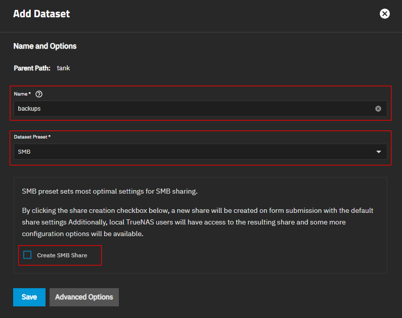

- Creating user dataset under the `backups` dataset:
  - Select the `backups` dataset and press the `Add Dataset` button on the right.
  - In the `Name` field, enter the name of the user for whom we are creating the file space.
  - Select `SMB` preset from the `Dataset Preset` dropdown.
  - Uncheck the `Create SMB Share` checkbox (we will configure SMB later).
  - Press the `Save` button.
  - In the `Set ACL for this dataset` dialog box, select `Return to pool list`.
  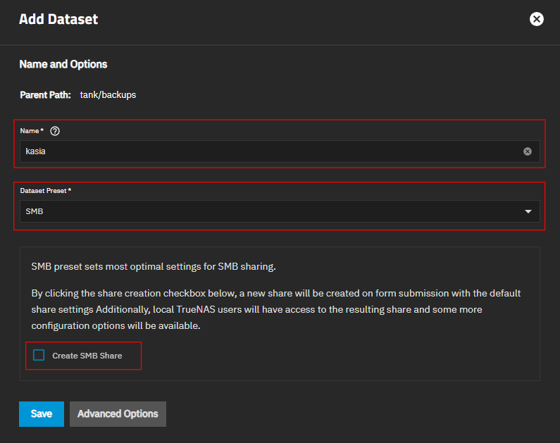

- Setting permissions for the newly created user dataset:
  - Select the user dataset you created in the previous step.
  - On the right side, in the `Permissions` widget press the `Edit` button.
  - The `Edit ACL` (Access Control List) dialog opens.
  - Press the `Use Preset` button.
  - From the `Preset` dropdown select `NFS4_RESTRICTED` and press the `Continue` button.
  - Now, access to this dataset has only dataset `Owner` nad members of dataset `Owner Group` (see the screenshot below).
  - Do not `Save Access Control List` yet.
  - 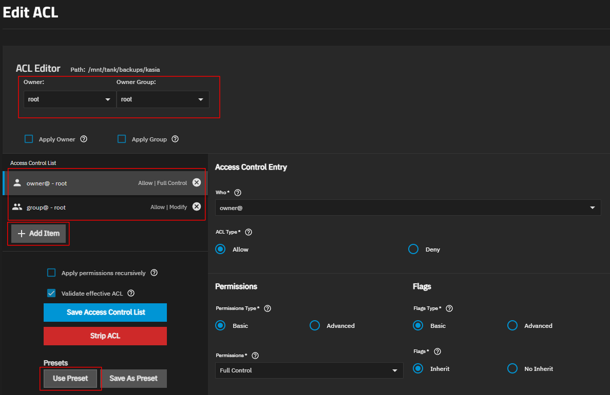

- Adding all admins to the user dataset ACL:
  - Press the `+  Add Item` button, placed inside `Access Control List` section.
  - Fill the `Access Control Entry` form as shown in the image below.
  - Do not `Save Access Control List` yet.
  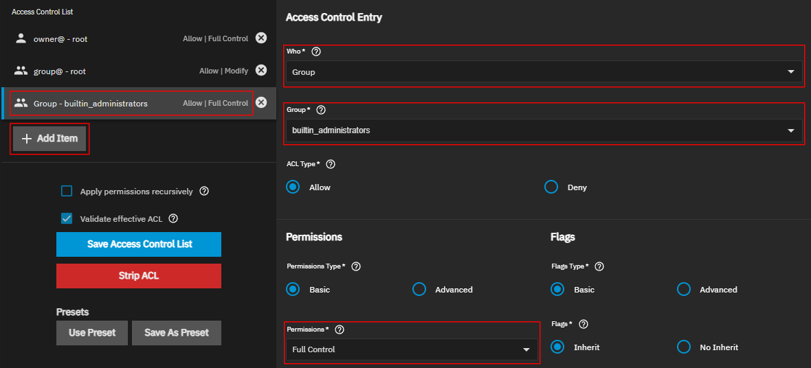

- Adding an ACL for the user for whom the dataset is intended:
  - Press the `+  Add Item` button, placed inside `Access Control List` section.
  - From the `Who` dropdown list select the `User` option.
  - From the `User` dropdown list select the the user for whom the dataset is intended.
  - Rest of the options inside the `Access Control Entry` form set as shown in the image below.
  
  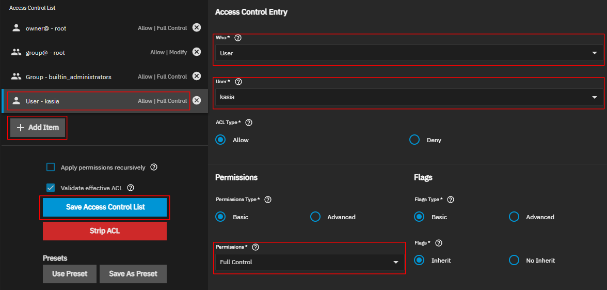

- Now you can finally `Save Access Control List`.

## 3. SMB configuration

- Open the `Shares` page.

- Inside the `Windows (SMB) Shares` press the `Add` button and in the dialog:
  - Set `Purpose` to `Default Share`.
  - In the `Path` tree, select the user dataset you want to share.
  - Set the `Name` to match the shared resource. \
    :exclamation: **IMPORTANT: this name will be used to access our NAS shared data from Windows OS.**
  - Leave the `Enabled` checkbox `checked`.
  - Press the `Save` button.

  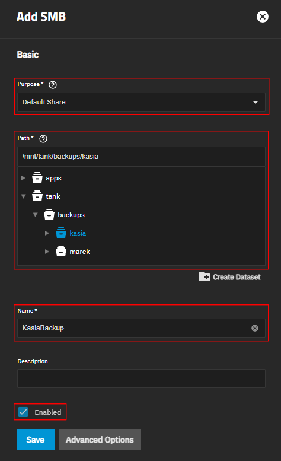

## 4. Access from Windows OS

- Check your IP address, should look something like this: `192.168.X.X` \
  (it may look different depending on your local network settings).

  _It's good practice to set a static IP address for your NAS on your local network, \
  but that's beyond this guide. Search online for instructions._
 
  Method 1:
  - Open `Dashboard` page and look for the `Address` widget

  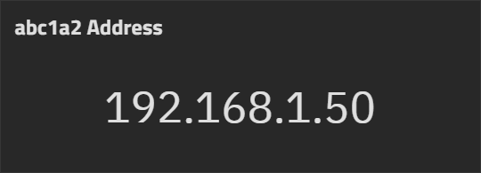

  Method 2:
  - Open `System` / `Network` page and and find your IP address in the `Interfaces` widget.

  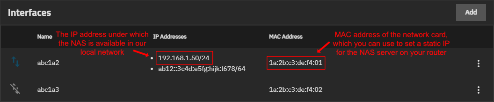

- In the Windows OS, open the File Explorer.

- Select the `Network` tab in the left sidebar.

- When you right-click on the `Network` tab or click the ellipsis (`…`) at the top of the window, the `Map network drive...` option should appear, just select it.

  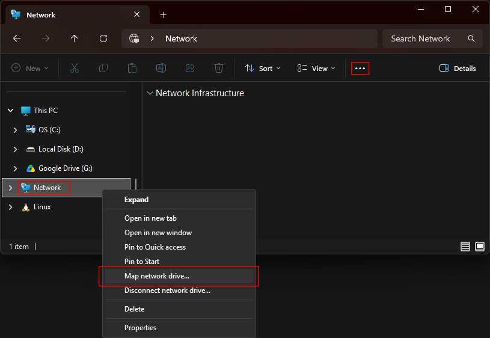

- Select the `Drive` letter to which you want to map the shared dataset.

- In the `Folder` field, enter: `\\NAS_IP\SMB_NAME`, where: \
  `NAS_IP` - this is your NAS IP address which we previously checked on our NAS, \
  `SMB_NAME` - the name of the SMB configuration we created earlier. \
  In my case the entire folder address looks like this: \
  `\\192.168.1.50\KasiaBackup`

- Select the `Reconnect at sign-in` checkbox, to make the drive be available right after the OS starts.

- Select the `Connect using different credentials` checkbox as we will use the account we previously added to the TrueNAS.

- Press the `Finish` button.

  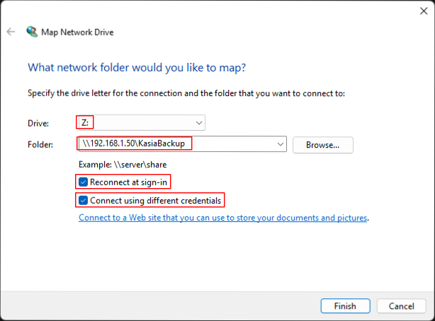

- In the next window, enter the login and password of the NAS user for whom we are sharing the dataset.

- From now on, you always have access to your network drive.

  _Open the network drive, add a file, edit it, then delete it, to verify that you have all the necessary permissions. If not, check the shared dataset's ACL (step 2 of the instruction)._

  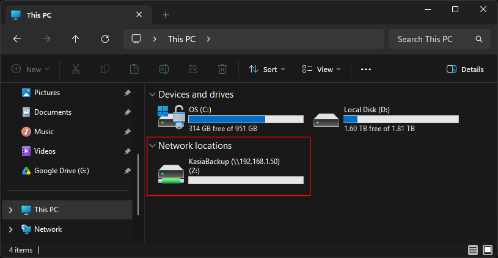

### 4.1. Access from Windows OS - Troubleshooting

**If you cannot connect a network drive on Windows OS and get e.g. the error "Access is denied", try these solutions:**

#### :one: Check which version of SMB protocol is enabled, for most of the people v1 is not working.
- Open PowerShell terminal and enter:
  ```ps
  Get-SmbServerConfiguration | Format-List EnableSMB*
  ```
- You should see output like that:
  ```ps
  EnableSMB1Protocol : False
  EnableSMB2Protocol : True
  ```
- If the `EnableSMB1Protocol` is enabled, you can disable it by running the command:
  ```ps
  Set-SmbServerConfiguration -EnableSMB1Protocol $false
  ```
  - The confirmation message should be displayed ("Are you sure you want to perform this action?"). \
  Type in `Y` and press `Enter` to confirm the action.

- If the `EnableSMB2Protocol` is disabled, you can enable using command:
  ```ps
  Set-SmbServerConfiguration -EnableSMB2Protocol $true
  ```
  - The confirmation message should be displayed ("Are you sure you want to perform this action?"). \
  Type in `Y` and press `Enter` to confirm the action.


#### :two: Sometimes the connection is restricted by user Group Policy (`Network security: LAN Manager authentication level`).**

  - Use shortcut `Ctrl` + `R` or open `Start` menu and select `Run` option.
  - Type in `gpedit.msc` and press `Enter`.
  - From the tree on the left select: \
    `Local Computer Policy` → `Computer Configuration` → `Windows Settings` → `Security Settings` → `Local Policies` → `Security Options`
  - On the right side find an entry `Network security: LAN Manager authentication level` and open it.
  - From the dropdown select the `Send NTLMv2 response only. Rrefuse LM & NTLM` option and press `OK` button.

## 5. Setting the snapshots

- Open the `Data Protection` page.

- Inside the `Periodic Snapshot Tasks` press the `Add` button.

- Select the `tank/backups` from the `Dataset` dropdown.

- Select the `Recursive` checkbox. \
  In this way, snapshots of all datasets within `tank/backups` will be automatically taken.

- Define `Schedule`.

- Press the `Save` button.

\___

```
TODO: describe in more detail how to set snapshots for user data backups, recommended settings, etc.
```

<p align="right"><sub>____________</sub></p>
<p align="right">
  <a href="../truenas-setup/next-page-url">Next step: ??? →</a>
</p>
