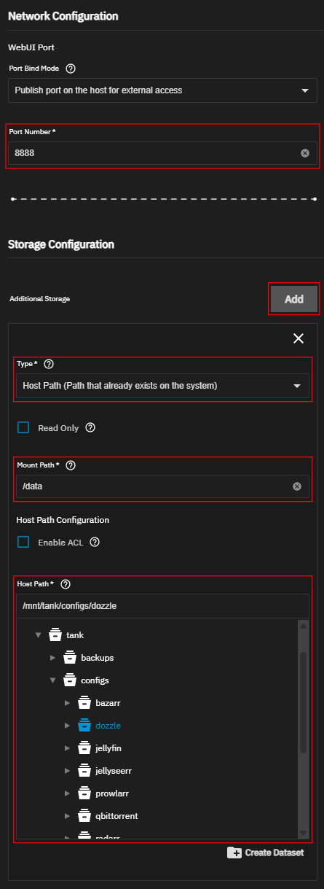
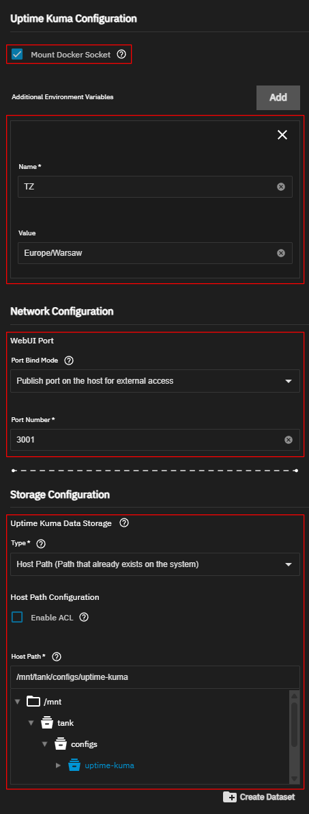
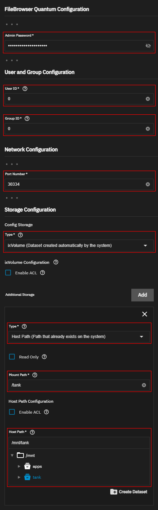
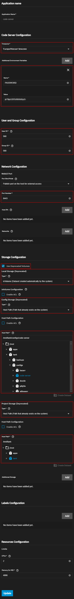
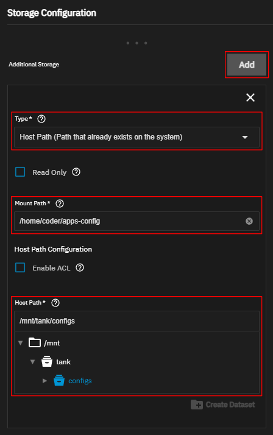

[← Back to the main guide's steps](../README.md)

# Useful Apps

**Table of Contents**   
[1. List of applications](#1-list-of-applications)  
[2. Dozzle](#2-dozzle---installation-and-configuration)  
&nbsp; &nbsp; [2.1 Installing Dozzle via native TrueNAS Apps](#21-installing-dozzle-via-native-truenas-apps)  
&nbsp; &nbsp; [2.2 Installing Dozzle via YAML](#22-installing-dozzle-via-yaml)  
[3. Uptime Kuma](#3-uptime-kuma---installation-and-configuration)  
&nbsp; &nbsp; [3.1 Installing Uptime Kuma via native TrueNAS Apps](#31-installing-uptime-kuma-via-native-truenas-apps)  
&nbsp; &nbsp; [3.2 Installing Uptime Kuma via YAML](#32-installing-uptime-kuma-via-yaml)  
&nbsp; &nbsp; [3.3 Configuration of Uptime Kuma](#33-configuration-of-uptime-kuma)  
[4. FileBrowser Quantum](#4-filebrowser-quantum---installation-and-configuration)  
[5. Code Server](#5-code-server---installation-and-configuration)  
&nbsp; &nbsp; [5.1 Installing Code Server via native TrueNAS Apps](#51-installing-code-server-via-native-truenas-apps)  
&nbsp; &nbsp; [5.2 Installing Code Server via YAML](#52-installing-code-server-via-yaml)  
&nbsp; &nbsp; [5.3 Access your location directory from Code Server](#53-access-your-location-directory-from-code-server)  
&nbsp; &nbsp; [5.4 My Code Server preferences and installed extensions](#54-my-code-server-preferences-and-installed-extensions)  
[6. Homepage](#6-homepage---installation-and-configuration)  


This file contains instructions for installing and configuring useful applications (which will come in handy for day-to-day NAS management, installing and modifying applications, etc.). \
These are apps you simply can't do without (alternatively, you can install similar apps that serve the same purpose).

## 1. List of applications

| Name                | Description                                                                                                                                                                | Documentation                                              |
|---------------------|----------------------------------------------------------------------------------------------------------------------------------------------------------------------------|------------------------------------------------------------|
| Dozzle              | Dozzle is a lightweight, web-based application for monitoring Docker logs in real time.                                                                                    | [GitHub page](https://github.com/amir20/dozzle)            |
| Uptime Kuma         | Uptime Kuma is an easy-to-use self-hosted monitoring tool. It allows you to monitor uptime - for example, for Docker containers and set up various types of notifications. | [GitHub page](https://github.com/louislam/uptime-kuma)     |
| FileBrowser Quantum | It is a file manager with source configuration, modern authentication, office support, and lightning-fast search.                                                          | [GitHub page](https://github.com/gtsteffaniak/filebrowser) |
| Code Server         | Allows to run instance of VS Code that you can access from your browser. Useful for easily editing all kinds of files.                                                     | [GitHub page](https://github.com/coder/code-server)        |
| Homepage            | Allows you to create one panel to manage all your services.                                                                                                                | [GitHub page](https://github.com/gethomepage/homepage)     |

 file manager with source configuration, modern authentication, office support, and lightning-fast search.


## 2. Dozzle - installation and configuration
Create datasets:

```js
tank [POOL]
└─ configs [DATASET] - Dataset Preset: `Apps`
   └─ dozzle [DATASET] - Dataset Preset: `Apps`
```

### 2.1 Installing Dozzle via native TrueNAS Apps

Install Dozzle via TrueNAS Apps with such configuration:

- In the field `Port Number` enter: `8888`

- Add `Additional Storage`:
  - `Type`: `Host Path (Path that already exists on the system)`
  - `Mount Path`: `/data`
  - `Host Path`: `/mnt/tank/configs/dozzle`

- Leave the other fields at their default values



### 2.2 Installing Dozzle via YAML 

Use this YAML code to install Dozzle:

```yml
services:
  dozzle:
    container_name: dozzle
    image: amir20/dozzle:latest
    ports:
      - "8888:8080"
    volumes:
      - /var/run/docker.sock:/var/run/docker.sock
      - /mnt/tank/configs/dozzle:/data
    restart: unless-stopped
    environment:
      - TZ=Europe/Warsaw
```

To set app TrueNAS Apps title and icon, edit file `/mnt/.ix-apps/app_configs/dozzle/metadata.yaml`. \
In "metadata" section add "title" and "icon":
```yaml
# ...
"metadata":
  # ...
  # to set icon from a local file, use: "file:///root/my_icon.svg"
  "icon": "https://media.sys.truenas.net/apps/dozzle/icons/icon.svg"
  "title": "Dozzle"
# ...
```

## 3. Uptime Kuma - installation and configuration

Create datasets:

```js
tank [POOL]
└─ configs [DATASET] - Dataset Preset: `Apps`
   └─ uptime-kuma [DATASET] - Dataset Preset: `Apps`
```


### 3.1 Installing Uptime Kuma via native TrueNAS Apps

Install Uptime Kuma via TrueNAS Apps with such configuration:

- Select the `Mount Docker Socket` checkbox

- Add Environment Variable:  
  **If an error related with TZ env variable occurs during app installation, do not add this env variable**  
  - `Name`: `TZ`
  - `Value`: `Europe/Warsaw`

- In the field `Port Number` enter: `3001`

- Set `Uptime Kuma Data Storage` to:
  -  `Type`: `Host Path (Path that already exists on the system)`
  -  `Host Path`: `/mnt/tank/configs/uptime-kuma`

- Leave the other fields at their default values



### 3.2 Installing Uptime Kuma via YAML 

Use this YAML code to install Dozzle:

```yml
services:
  uptime-kuma:
    container_name: uptime-kuma
    image: louislam/uptime-kuma:latest
    ports:
      - 3001:3001
    volumes:
      - /var/run/docker.sock:/var/run/docker.sock
      - /mnt/tank/configs/uptime-kuma:/app/data
    environment:
      - TZ=Europe/Warsaw
    restart: unless-stopped
```

### 3.3 Configuration of Uptime Kuma

Open Uptime Kuma Web UI `http://YOUR_NAS_IP:3001`, ex. `192.168.1.50:3001`

If this is your first time visiting this page, you will be asked to create a user account.

An example of adding uptime monitoring for a Dozzle Docker container:
- Press the `+ Add New Monitor` button.
- In the `Monitor Type` field, select `HTTP(s)`.
- In the `Friendly Name` field , enter `Dozzle`.
- In the `URL` field, enter `http://YOUR_NAS_IP:8888` (ex. `http://192.168.1.50:8888`).
- Set the rest of the settings according to your preferences.
- Press the `Save` button.

Setting up notifications:
- Click on the user icon (in the top right-hand corner)
- Select the `Settings` option
- Select the `Notifications` tab
- Press the `Set Up Notification` button
- Setup your notification (ex. Gotify)


# 4. FileBrowser Quantum - installation and configuration

**Installing FileBrowser Quantum via native TrueNAS Apps**

Install FileBrowser Quantum via TrueNAS Apps with such configuration:

- In the field `Admin Password` enter your admin password

- In the `User and Group Configuration` section set:
  - In the field `User ID` enter `0`

  - In the field `Group ID` enter `0`  

    :exclamation: **IMPORTANT: I use the root user (`0`) and group (`0`) to allow the application to access all directories and avoid problems with permissions. This isn’t a problem for me as I only use this application on the local network, but if you intend to grant public access, set the appropriate user and group.**

- In the field `Port Number` enter: `30334`

- In the `Storage Configuration`/`Config Storage` section, in the `Type` field select `ixVolume (Dataset created automatically by the system)`.  
  It’s just a file browser, so I don’t need to back up the configuration files. At least for me, it doesn’t matter.

- In the `Storage Configuration` section, add `Additional Storage` witch such settings:

  _(This setting allows you to manage files across the entire `/tank` pool)_

  -  In the `Type` field, select the `Host Path (Path that already exists on the system)` option.

  -  In the `Mount Path`, enter `/tank`

  -  In the `Host Path` field, enter `/mnt/tank`
  
- Leave the other fields at their default values



## 5. Code Server - installation and configuration

Create datasets:

```js
tank [POOL]
└─ configs [DATASET] - Dataset Preset: `Apps`
   └─ code-server [DATASET] - Dataset Preset: `Apps`
```

### 5.1 Installing Code Server via native TrueNAS Apps 

Install Code Server via TrueNAS Apps with such configuration:

- In the `Timezone` field, select your timezone (ex. `Europe\Warsaw`)

- Add `Additional Environment Variable`:
  - `Name`: `PASSWORD`
  - `Value`: EnterYourCodeServerPassword

- In the `User and Group Configuration` section, set:

  - In the `User ID` field, enter: `568`

  - In the `Group ID` field, enter: `568`

- In the field `Port Number` enter: `8443`

- In the section `Storage Configuration`:

  - Leave the `Use Deprecated Volumes` checkbox `unchecked`

  - Set `Home Directory Storage` to:
    -  `Type`: `ixVolume (Dataset created automatically by the system)`

  - Add `Additional Storage` with settings:
    -  `Type`: `Host Path (Path that already exists on the system)`
    -  `Mount Path`: `/config`
    -  `Host Path`: `/mnt/tank/configs/code-server`

- Leave the other fields at their default values



### 5.2 Installing Code Server via YAML

Use this YAML code to install Code Server:

```yml
services:
  code-server:
    container_name: code-server
    image: lscr.io/linuxserver/code-server:latest
    ports:
      - 8443:8443
    volumes:
      - /mnt/tank/configs/code-server:/config
      - /mnt/tank/configs:/home/coder/apps-config
    restart: unless-stopped
    environment:
      - PUID=568
      - PGID=568
      - TZ=Europe/Warsaw
      - PASSWORD=EnterYourCodeServerPassword
```

### 5.3 Access your location directory from Code Server

To access some directory from drive in Code Server:

- Got to TrueNAS `Apps` page.

- Find `Code Server` on the list and select it.

- Press the `Edit` button.

- In the section `Storage Configuration` add `Additional Storage` with settings:
    -  `Type`: `Host Path (Path that already exists on the system)`
    -  `Mount Path`: `/home/coder/apps-config`
    -  `Host Path`: `/mnt/tank/configs`

- Save changes.



This setting will cause the `/mnt/tank/configs` directory to be displayed as follows in Code Server: 


### 5.4 My Code Server preferences and installed extensions

**My preferences:**
- Open `Settings`/`Workbench`/`Appearance`  
  - set `Color Theme` to `Dark (Visual Studio)`

**Installed Extensions:**
- YAML (Identifier: redhat.vscode-yaml)
- XML (Identifier: redhat.vscode-xml)
- Prettier - Code formatter (Identifier: esbenp.prettier-vscode)
- Code Spell Checker (Identifier: streetsidesoftware.code-spell-checker)
- TODO Highlight (Identifier: wayou.vscode-todo-highlight)
- vscode-icons (Identifier: vscode-icons-team.vscode-icons)
- GitLens (Identifier: eamodio.gitlens)
- shell-format (Identifier: foxundermoon.shell-format)
- IntelliJ IDEA Keybindings (Identifier: k--kato.intellij-idea-keybindings)


## 6. Homepage - installation and configuration

Create datasets:

```js
tank [POOL]
└─ configs [DATASET] - Dataset Preset: `Apps`
   ├─ system [DATASET] - Dataset Preset: `Apps`
   |  └─ app-icons [DATASET] - Dataset Preset: `Apps`
          └─ homepage-app-icon.png [FILE]
   └─ homepage [DATASET] - Dataset Preset: `Apps`
```
Link to [homepage-app-icon.png file](../app-icons/homepage-app-icon.png)

### 6.1 Installing Homepage via native TrueNAS Apps 

Install Homepage via TrueNAS Apps with such configuration:

### 6.2 Installing Homepage via YAML. 

Use this YAML code to install Homepage:

```yml
services:
```

Edit the `/mnt/.ix-apps/app_configs/homepage/metadata.yaml` file, and set:
```yaml
"custom_app": true
"human_version": "v1.13.3"
"metadata":
  "app_version": "v1.13.3"
  "capabilities": []
  "categories":
  - "productivity"
  "changelog_url": "https://github.com/gethomepage/homeapge/releases"
  "description": "Homepage is a modern, secure, highly customizable application dashboard."
  "home": "https://gethomepage.dev/"
  "host_mounts":
  - "description": "Docker socket"
    "host_path": "/var/run/docker.sock"
  # "icon": "https://media.sys.truenas.net/apps/homepage/icons/icon.png"
  "icon": "file:///mnt/tank/configs/system/app-icons/homepage-app-icon.png"
  "keywords":
  - "dashboard"
  "maintainers": []
  "name": "homepage"
  "run_as_context":
  - "description": "Container [homepage] runs as non-root user and group."
    "gid": 568
    "group_name": "Host group is [apps]"
    "uid": 568
    "user_name": "Host user is [apps]"
  "sources":
  - "https://gethomepage.dev/"
  - "https://github.com/gethomepage/homepage"
  "title": "Homepage"
  "train": "community"
  "version": "1.3.13"
"migrated": false
"notes": null
"portals":
  "Web UI": "http://0.0.0.0:3000"
"version": "1.3.13"
```
Set version based on docker image that you use.

- On TrueNAS you can use nano to edit the metadata.yaml file:

    ```bash
    cd /mnt/.ix-apps/app_configs/homepage
    ```

    ```bash
    sudo nano metadata.yaml
    ```

- Once you've finished editing, press [Ctrl] + [O] to save your changes

- Then press [Ctrl] + [X] to exit the nano editor.

You can also copy my pre-made [homepage-metadata.yaml](../yaml/homepage-metadata.yaml) file. Just rename it to metadata.yaml and replace the original version with this one. You'll likely need to update the version to match your actual one.
- open directory"
  ```bash
  cd /mnt/.ix-apps/app_configs/homepage
  ```
- create backup of metadata.yaml file"
  ```bash
  sudo mv metadata.yaml metadata_bkp.yaml
  ```
- download pre-made metadata.yaml file"
  ```bash
  sudo curl -o metadata.yaml https://raw.githubusercontent.com/mskrzyniarz/nas-config/refs/heads/main/yaml/homepage-metadata.yaml
  ```
- create version 1.13.3 from 1.0.0:
  ```bash
  cp versions/1.0.0 versions/1.13.3
  ```
- open settings of version 1.13.3:
  ```bash
  cd versions/1.13.3
  ```
- create backup of app.yaml file"
  ```bash
  sudo mv app.yaml app_bkp.yaml
  ```
- download pre-made app.yaml file"
  ```bash
  sudo curl -o app.yaml https://raw.githubusercontent.com/mskrzyniarz/nas-config/refs/heads/main/yaml/homepage-app.yaml
  ```

<p align="right"><sub>____________</sub></p>
<p align="right">
  <a href="./ARR_Stack.md">Next step: ARR Stack - General →</a>
</p>
