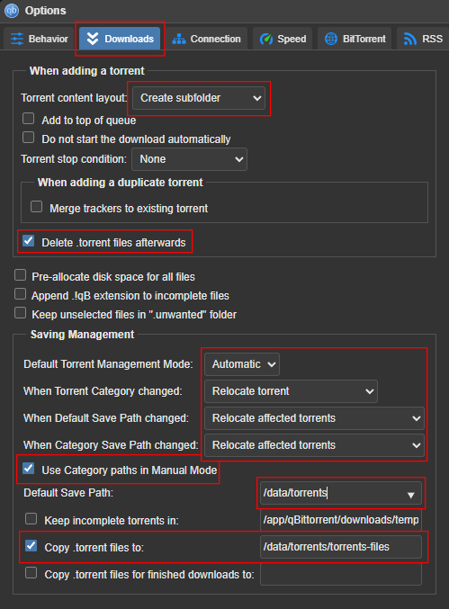

[← Back to the main guide's steps](../README.md)

# [ARR Stack] qBitTorrent with Proton VPN 

This guide was developed based on the [TRaSH-Guides](https://github.com/TRaSH-Guides/Guides):  
- [qBittorrent - Basic Setup](https://trash-guides.info/Downloaders/qBittorrent/Basic-Setup/)
- [qBittorrent - How to add categories](https://trash-guides.info/Downloaders/qBittorrent/How-to-add-categories/)
- [qBittorrent - Paths](https://trash-guides.info/Downloaders/qBittorrent/Paths/)
- [qBittorrent - Port forwarding](https://trash-guides.info/Downloaders/qBittorrent/Port-forwarding/)

and it uses `hotio/qbittorrent` Docker image: \
[https://hotio.dev/containers/qbittorrent/](https://hotio.dev/containers/qbittorrent/)

<br />

**Table of Contents**   
[1. Preparation of files structure](#1-preparation-of-files-structure)  


Your downloads will not go into the category folder

## 1. Preparation of files structure

Datasets structure:
```js
tank [POOL]
└── configs [DATASET] - 'Dataset Preset': 'Apps'
    └─ qbittorrent [DATASET] - 'Dataset Preset': 'Apps'
       └─ wireguard [FOLDER]
          └─ wg0.conf [FILE]
```

Create dataset:
```
/mnt/tank/configs/qbittorrent
```

Create folders according to the structure shown above.

Just open a shell and enter these commands:

```bash
sudo mkdir -p /mnt/tank/configs/qbittorrent/config/wireguard
```

Open Proton VPN, generate wireguard configuration and copy it.

To edit the `/mnt/tank/configs/qbittorrent/wireguard/wg0.conf` file, run this command:
```bash
sudo nano /mnt/tank/configs/qbittorrent/wireguard/wg0.conf
```
  _If the file does not exist it will be created automatically._

Paste the copied text. Save the file (`[Ctrl]` + `[O]`). Close the file (`[Ctrl]` + `[X]`).

Edit the permissions of the `/tank/configs/qbittorrent` dataset and recursively apply the permissions to all of its children.

## 2. Installation

Install qBittorrent via TrueNAS Custom Apps using this YAML file:

```yaml
services:
  qbittorrent:
    container_name: qbittorrent
    image: ghcr.io/hotio/qbittorrent
    cap_add:
      - NET_ADMIN
    user: '0:0'
    ports:
      - 8080:8080
      - 51820:51820  # enter the port number from the Wireguard config file here
      - 51820:51820/udp  # enter the port number from the Wireguard config file here
    volumes:
      - /mnt/tank/configs/qbittorrent:/config
      - /mnt/tank/data/torrents/:/data/torrents/
    restart: unless-stopped
    environment:
      - PUID=568
      - PGID=568
      - UMASK=002
      - TZ=Europe/Warsaw
      - WEBUI_PORT=8080
      - LIBTORRENT=v1
      - VPN_ENABLED=true
      - VPN_CONF=wg0
      - VPN_PROVIDER=proton
      - VPN_LAN_NETWORK=192.168.1.0/24 # enter your LAN network here
      - VPN_LAN_LEAK_ENABLED=false
      - VPN_AUTO_PORT_FORWARD=51820 # enter the port number from the Wireguard config file here
      - VPN_HEALTHCHECK_ENABLED=false
      - VPN_NAMESERVERS=wg
      - PRIVOXY_ENABLED=false
      - UNBOUND_ENABLED=false
    sysctls:
      - net.ipv4.conf.all.src_valid_mark=1
      - net.ipv6.conf.all.disable_ipv6=1

x-portals:
  - host: 0.0.0.0
    name: Web UI
    path: /
    port: 8080
    scheme: http

```

Open logs and look for username and password, it should look like that:
```
The WebUI administrator username is: admin
The WebUI administrator password was not set. A temporary password is provided for this session: hs7xMA9Mv
```

Open qBittorrent Web UI (`http://YOUR.IP:8080`)

Use login and password from logs to sign in

## 3. Configuration

### 3.1 Change username and password

- Go to: `Tools` / `Options` / `WebUI`

- In the section `Authentication` / `User` set your `Username` and `Password`.

- Save changes.

### 3.2. Add categories and configure Download settings

#### Creating categories

Right click on the `All (0)` label under `CATEGORIES` section, placed inside the left sidebar.

Select the `Add category...` option

Add `books` category:
- In the `Category` field, enter: `books`.
- In the `Save path` field, enter: `books`

Repeat the steps to add other categories:

Add `movies` category:
- In the `Category` field, enter: `movies`.
- In the `Save path` field, enter: `movies`.

Add `music` category:
- In the `Category` field, enter: `music`.
- In the `Save path` field, enter: `music`.

Add `tv` category:
- In the `Category` field, enter: `tv`.
- In the `Save path` field, enter: `tv`.

#### Configuring Download settings

Go to: `Tools` / `Options` / `Downloads`

In the `When adding a torrent` section set:

- `Torrent content layout` to `Create subfolder`.

- Select the `Delete .torrent files afterwards` checkbox.

In the `Saving Management` section, set:
  
- `Default Torrent Management Mode` to `Automatic`.  
  _If it is set to `Automatic` the your downloads will go into the proper category folders._

- `When Torrent Category changed` to `Relocate torrent`.

- `When Default Save Path changed` to `Relocate affected torrents`.

- `When Category Save Path changed` to `Relocate affected torrents`.

- Select the `Use Category paths in Manual Mode` checkbox

- Change `Default Save Path` to `/data/torrents`

- Select the `Copy .torrent files to` checkbox and set it to `/data/torrents/torrents-files`.

<br />



### 3.2. Configure other settings

Other settings should be set automatically based on Wireguard config file and properties passed to the `hotio/qbittorrent` Docker image.

But if you want to check if everything is set correctly. Compare the settings with the [TRaSH-Guides](https://github.com/TRaSH-Guides/Guides):  
- [qBittorrent - Basic Setup](https://trash-guides.info/Downloaders/qBittorrent/Basic-Setup/)
- [qBittorrent - How to add categories](https://trash-guides.info/Downloaders/qBittorrent/How-to-add-categories/)
- [qBittorrent - Paths](https://trash-guides.info/Downloaders/qBittorrent/Paths/)
- [qBittorrent - Port forwarding](https://trash-guides.info/Downloaders/qBittorrent/Port-forwarding/)


## 4. Test connection

### 4.1. To check if downloading and uploading data is working at all

Open Ubuntu Alternative downloads page: [https://ubuntu.com/download/alternative-downloads](https://ubuntu.com/download/alternative-downloads)

Find BitTorrent section/tab, download any torrent file.

Open BitTorrent WebUI and add the downloaded file.

### 4.2. To check if your VPN is working properly

Open the [Bash.ws](https://bash.ws/torrent-leak-test).

Start test.

An option to download the torrent file should be displayed.

Download the file, don't close the [Bash.ws](https://bash.ws/torrent-leak-test) page.

Open BitTorrent WebUI and add the downloaded file.

Return to the opened [Bash.ws](https://bash.ws/torrent-leak-test) page and check the test results.

<p align="right"><sub>____________</sub></p>
<p align="right">
  <a href="../truenas-setup/next-setp">Next step →</a>
</p>
